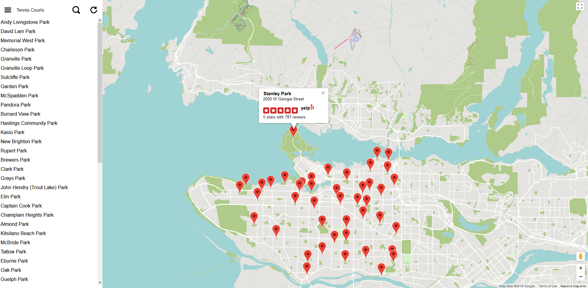

# Vancouver Parks

A Google Maps application showcasing parks in Vancouver BC.



## Features

* Displays the locations and names of all parks in Vancouver
* The ability to filter parks by name, neighbourhood, or amenity.
* Integrated Yelp ratings
* Responsive design

## Getting Started

### Required software:

* [NodeJS and npm](https://nodejs.org/en/)

* GIT

* UNIX-style shell

### Required credentials:

* [Yelp API Key](https://www.yelp.com/developers/documentation/v3/authentication)

### Setup

* Download the repository by entering `git clone https://github.com/Sebastian-/Vancouver-Parks.git` into the shell.

* `cd Vancouver-Parks/` then enter `npm install` to load all dependencies.

* Create a file named `credentials.json` containing your Yelp API key:

```
{
    "yelp_API_Key": "[YOUR_API_KEY_HERE]"
}
```

* Start the server by entering `node app.js`

* Visit [http://localhost:8080/](http://localhost:8080/) to view the site.

## Attributions

* Contains information licensed under the [Open Government Licence – Vancouver](http://vancouver.ca/your-government/open-data-catalogue.aspx). Data set can be found [here](http://data.vancouver.ca/datacatalogue/parkListing.htm).

* Park ratings provided by [Yelp](https://www.yelp.com/)
